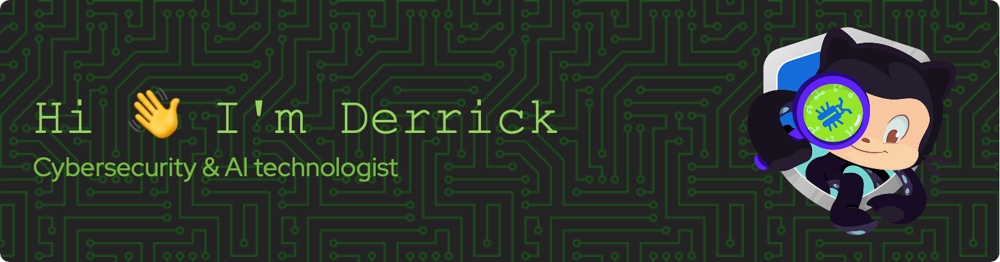

<!--
**derrick-roach/derrick-roach** is a ✨ _special_ ✨ repository because its `README.md` (this file) appears on your GitHub profile.

Here are some ideas to get you started:

- 🔭 I’m currently working on ...
- 🌱 I’m currently learning ...
- 👯 I’m looking to collaborate on ...
- 🤔 I’m looking for help with ...
- 💬 Ask me about ...
- 📫 How to reach me: ...
- 😄 Pronouns: ...
- ⚡ Fun fact: ...
-->

  

## 📝 about me

> Cybersecurity and AI professional experimenting with emerging technologies. 
> 
> Applying principles and wisdom from renowned thinkers. 
> 
> Learning by doing. 

  

| Me | Myself | and I |
|----------|----------|----------|
| 👨‍💻 **Technologist** | 🧠 **Self-taught Neanderthal** | 📚 **Lifelong learner** |
| 🧑‍🧑‍🧒‍🧒 **Cofounder of 2 kids** | 💭 **Chronic daydreamer** | 🔧 **Jack of all trades** |
| 🏆 **World’s okayest dad** | 🧐 **My own worst critic** | 🌐 **Generalist** |
| 🤔 **Master overthinker** | 🤷 **Skeptical optimist** | 📜 **Polymath** |
| 🏋️ **Armchair athlete** | 🤓 **Wise fool** | 🧘 **Stoic** |

 

- 💼 I'm a consultant, technologist, and AI explorer
- 👨‍👩‍👧‍👧 I'm a cofounder of 2 kids, happily married 💍, and a food 🍔🍕🌮 lover
- 🔭 I’m currently working on applied AI, blogging, uncommon engineering, FIRE, and AI experiments
- 🌱 I’m currently learning/improving my skills on AI, entrepreneurship, leverage, writing, and creating value
- 💬 Ask me about AI, cybersecurity, engineering, FIRE, and technology
- 🧪 My Laboratory: [derrick-roach.github.io](https://derrick-roach.github.io)

 

## ⚙️ skills 🛠️

| 🛡️ | 🔒 |
|:----------|----------:|
| **Application Security** | **Security Assessment** |
| **DevSecOps** | **Security Operations** |
| **Risk Assessment** | **FedRAMP Audits** |
| **Risk Management** | **HIPAA Security** |
| **Project Management** | **Compliance Management** |
| **Vulnerability Management** | **System Administration** |
| **Continuous Monitoring** | **System Configuration** |
| **Strategic Planning** | **Problem Solving** |
| **Software Supply Chain Security** | **Security Automation** |
| **Secure SDLC** | **SAST/DAST** |

  
&nbsp;
&nbsp;
&nbsp;
  

### 🤝 lets connect 🔗

 

### 💻 tech stack 📚

<!-- https://github.com/Ileriayo/markdown-badges -->

  

  
